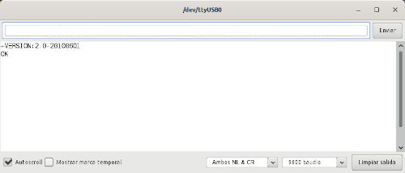

# **Montajes y establecimiento de conexión**
En el caso del módulo HC-05 debemos proceder de manera diferente en función de que el módulo disponga o no de un botón pulsador que permita establecer la comunicación Bluetooth con el mismo.

## **Módulo Bluetooth HC-05 *CON* botón**
Para este caso el montaje que debemos realizar lo vemos en la imagen siguiente:

| Conexión Arduino Nano-HC05 con botón pulsador|
|:|
| |

El programa que podemos grabar en el Nano para esta ocasión lo vamos a diferenciar, creando uno para cada modo de funcionamiento.

* **Modo AT2**. El programa es el siguiente:

~~~
#include <SoftwareSerial.h>
// Definimos una conexión utilizando la librería
SoftwareSerial conex_BT(10, 11); // Recuerda cruzar RX con TX
void setup(){ 
  Serial.begin(9600);     // Velocidad de comunicación con el monitor serie
  Serial.println("Alimentamos el modulo HC-05 mientras se mantiene presionado el pulsador");
  Serial println("De esta forma se habilita el modo AT2");
  Serial.println("El LED parpadea lentamente y el módulo listo para trabajar con comandos AT:");
  conex_BT.begin(38400);  // Inicializa el puerto serie o consola
}
void loop(){  
  if (conex_BT.available())
    Serial.write(conex_BT.read());
  if (Serial.available())
    conex_BT.write(Serial.read());
}
~~~

Una vez subido el programa a nuestra placa tomamos el módulo BT y accionamos el pulsador y sin soltarlo procedemos a conectar la placa al puerto USB para alimentar ambos dispositivos. Tras un instante podemos observar que el LED parpadea lentamente indicando que estamos en modo AT2 y que podemos enviar comandos AT al mismo. En la imagen siguiente vemos el resultado de comprobar que todo es correcto obteniendo el primer OK como respuesta al comando AT. También vemos la respuesta a otros comandos.

| Respuesta al comando AT en modo AT2|
|:|
| |

Ya podemos enviar cualquier comando AT de los que vemos en el apartado correspondiente.

* **Modo AT1**. El programa que vamos a utilizar es el siguiente:

~~~
#include <SoftwareSerial.h>
// Definimos una conexión utilizando la librería
SoftwareSerial conex_BT(10, 11); // Recuerda cruzar RX con TX
void setup(){ 
  Serial.begin(9600);     // Velocidad de comunicación con el monitor serie
  Serial.println("Alimentamos el modulo HC-05");
  Serial.println("Accionamos el pulsador para entrar en el modo AT1");
  Serial.println("El LED continua parpadeando rápidamente y el módulo está listo para trabajar con comandos AT");
  conex_BT.begin(115200);  // Velocidad a la que está configurado el módulo
}
void loop(){  
  if (conex_BT.available())
    Serial.write(conex_BT.read());
  if (Serial.available())
    conex_BT.write(Serial.read());
}
~~~

Disponemos de un módulo previamente configurado a 115200 baudios, razón por la que ponemos la instrucción *conex_BT.begin(115200);*.

Una vez subido el programa pulsamos el botón y probamos el funcionamiento, tal y como vemos en la imagen siguiente:

| Respuesta al comando AT en modo AT1|
|:|
| |

## **Módulo Bluetooth HC-05 *SIN* botón**
Recordemos que para este caso debemos montar el circuito de la imagen siguiente:

| Conexión Arduino Nano-HC05 sin botón pulsador|
|:|
| |

Para poder trabajar vamos a crear en el IDE de Arduino un programa como el siguiente:

~~~
#include <SoftwareSerial.h>
// Definimos una conexión utilizando la librería
SoftwareSerial conex_BT(10, 11); // Recuerda cruzar RX con TX
void setup(){ 
  pinMode(8, OUTPUT);     // Configuramos pin 8 como salida
  pinMode(9, OUTPUT);     // Configuramos pin 9 como salida cuando se alimente de aqui
  digitalWrite(9, HIGH);  // Ponemos el pin Enable/Key en alto
  delay (500) ;           // Espera un tiempo antes de alimentar el modulo
  Serial.begin(9600);     // Velocidad de comunicación con el monitor serie
  Serial.println("Alimentamos el modulo HC-05. Se habilita el modo AT");
  digitalWrite (8, HIGH); //Al poner en HIGH alimentamos el HC-05 y forzaremos el modo AT
  Serial.println("Módulo listo para trabajar con comandos AT:");
  conex_BT.begin(38400);  // Esta es la velocidad a la que está configurado el módulo
}
void loop(){  
  if (conex_BT.available())
    Serial.write(conex_BT.read());
  if (Serial.available())
    conex_BT.write(Serial.read());
}
~~~

En mi caso dispongo de un módulo configurado a una velocidad de 38400 baudios, de ahí la velocidad que establecemos para la conexión creada para los pines 10 y 11. Es importante entender que si cuando trabajemos con el código el monitor serie nos devuelve caracteres extraños o no responde a los comandos AT es porque esta velocidad será otra diferente que debemos averiguar para poder continuar. Esto lo hacemos cambiando esta velocidad entre las posibles hasta que demos con la que el módulo responda. La otra velocidad que se configura es la de comunicación con el monitor serie en el ordenador, que lógicamente podemos cambiar pero que no es necesario para estas pruebas.

## Comandos AT para el HC-05
En las líneas siguientes se van poniendo diferentes comandos y una imagen de la respuesta que se obtiene a cada uno de ellos.

### AT

El comando mas simple y primero que debemos probar antes de hacer nada mas es AT para verificar la comunicación, es decir, comprobamos que nuestro módulo Bluetooth responde a comandos AT.

Si tenemos una situación como la de la imagen siguiente podemos seguir con el comando AT que nos interesa de los que damos a continuación, o de otros que el lector puede estudiar, y si no debemos revisar cableado y velocidades de conexión.

| Respuesta al comando AT |
|:|
| |

### AT+VERSION?

| Consulta la versión del firmware del módulo |
|:|
| |

### AT+NAME? o AT+NAME=nnnn?

| Consulta o cambia el nombre del módulo |
|:|
| |

### AT+UART? o AT+UART=config
El valor de config debe establecerse como: **Baudios,Bit_parada,Paridad**

Este comando, en modo consulta nos va a devolver la velocidad de comunicación con el módulo. En la imagen vemos una secuencia en la que hemos cambiado la velocidad de 38400 a 57600 (AT+UART=57600,0,0) por ejemplo con resultado OK. El tercer OK entre UART corresponde a un comando AT, que vemos que sigue funcionando. Tras ello volvemos a cambiar la velocidad a 38400 y comprobamos con AT que todo es correcto. En la animación siguiente vemos el proceso.

| Consulta o cambia la velocidad de comunicación con el módulo |
|:|
| |

Las velocidades posibles son: 1200, 2400, 4800, 9600 (velocidad por defecto), 19200, 38400, 57600 o 115200 baudios.

### AT+PSWD? o AT+PSWD="nuevo-pin"

| Consulta o cambio de la clave o PIN de emparejamiento |
|:|
| |

### AT+ROLE? o AT+ROLE=n

Donde "n" puede tomar los siguientes valores:
- 0 lo configura en modo esclavo
- 1 lo configura en modo maestro

| Consulta o cambia el modo de operación entre maestro y esclavo |
|:|
| |

### Otros comando AT
Listamos los que pueden resultar útiles.

* **AT+STATE?**. El módulo responderá con el estado actual
* **AT+RESET**. Reinicio del módulo
* **AT+ORGL**. Para devolver al módulo sus valores de fábrica
* **AT+ADDR?**. Devuelve la dirección física o MAC del módulo
* **AT+IRQ**. Escanea y muestra la MAC de dispositivos en el alcance
* **AT+BIND=n**. Establece la MAC del dispositivo al cual se conectará el módulo al encenderse
* **AT+CMODE=n**. Con n=0 se conecta a la dirección física establecida con AT+BIND y n=1 para conectarse a cualquier dirección dentro de la cobertura del módulo.

## **Ejemplos de configuración del módulo HT-05**
Simplemente vamos a proponer dos ejemplos de configuración de varios parámetros de un módulo HC-05 en los que deberemos verificar los cambios realizados. La principal diferencia entre un ejemplo y otro va estar en que en el primero vamos a poner al HC-05 en modo maestro y en el segundo en modo esclavo.

### Ejemplo 1. Role maestro
Configurar un módulo HC-05 para que tenga las siguientes características:

1. Role o modo: **Maestro**
2. Baud rate o velocidad: **57600 baudios**
3. Nombre del dispositivo: **HC-05-Master**
4. PIN o código de emparejamiento del disposito a conectarse: **1465**

Antes de nada debemos poner nuestro módulo en modo AT para que pueda recibir los comandos de configuración. A continuación pongo la secuencia de comandos a enviar, debiendo todos ellos recibir como respuesta OK:

1. AT
2. AT+ROLE=1
3. AT+UART=57600,0,0
4. AT+NAME=HC-05-Master
5. AT+PSWD=1465
6. AT+CMODE=0

Una vez realizadas las configuraciones procedemos a verificar que todos los pasos han sido correctos. Una vez comprobado puede ser recomendable hacer un reset (AT+RESET) del módulo para tenerlo con configuración de fábrica la próxima vez que lo utilicemos.

### Ejemplo 2. Role esclavo
Configurar un módulo HC-05 para que tenga las siguientes características:

1. Role o modo: **Esclavo**
2. Baud rate o velocidad: **9600 baudios**
3. Nombre del dispositivo: **HC-05-Slave**
4. PIN o código de emparejamiento del disposito a conectarse: **1212**

Antes de nada debemos poner nuestro módulo en modo AT para que pueda recibir los comandos de configuración. A continuación pongo la secuencia de comandos a enviar, debiendo todos ellos recibir como respuesta OK:

1. AT
2. AT+ROLE=0
3. AT+UART=9600,0,0
4. AT+NAME=HC-05-Slave
5. AT+PSWD=1212

Una vez realizadas las configuraciones procedemos a verificar que todos los pasos han sido correctos. Una vez comprobado puede ser recomendable hacer un reset (AT+RESET) del módulo para tenerlo con configuración de fábrica la próxima vez que lo utilicemos.
