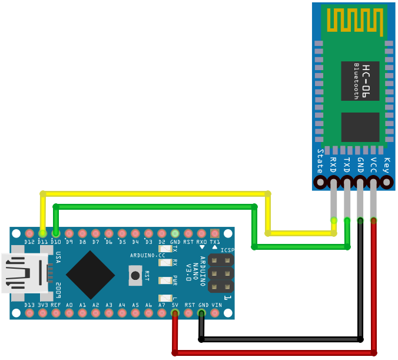
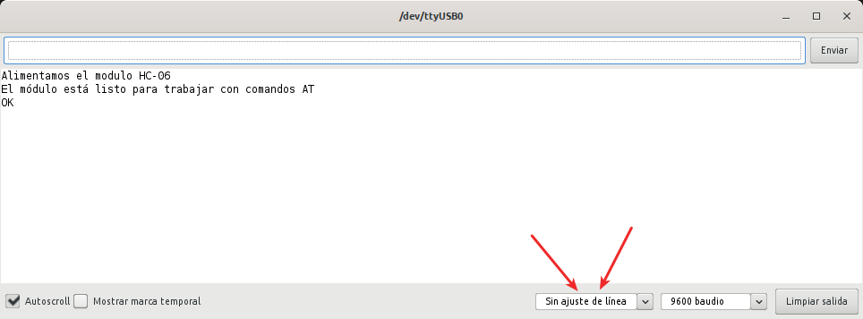
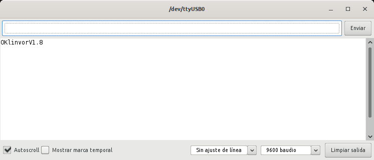
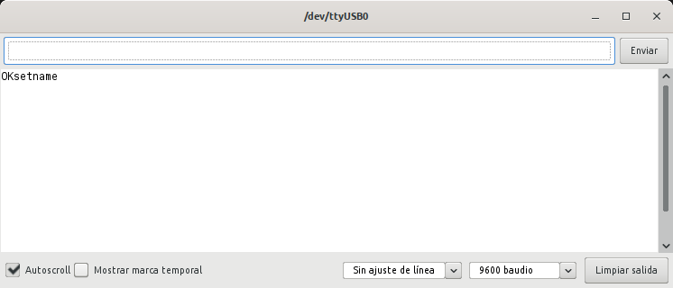

# **Montaje y establecimiento de conexión**
En el caso del módulo HC-06 debemos realizar el montaje que vemos en la imagen siguiente:

| Conexión Arduino Nano-HC06|
|:|
| |

En primer lugar recordemos que el módulo HC-06 se pone en modo AT cuando se alimenta y no está conectado con otro dispositivo.

El programa que podemos grabar en el Nano para esta ocasión es totalmente similar a los vistos para el HC-05 y puede ser como el siguiente:

~~~
#include <SoftwareSerial.h>
// Definimos una conexión utilizando la librería
SoftwareSerial conex_BT(10, 11); // Recuerda cruzar RX con TX
void setup(){ 
  Serial.begin(9600);     // Velocidad de comunicación con el monitor serie
  Serial.println("Alimentamos el modulo HC-06");
  Serial.println("El módulo está listo para trabajar con comandos AT");
  conex_BT.begin(9600);  // Velocidad a la que está configurado el módulo
}
void loop(){  
  if (conex_BT.available())
    Serial.write(conex_BT.read());
  if (Serial.available())
    conex_BT.write(Serial.read());
}
~~~

Una vez subido el programa a nuestra placa y si la velocidad de conexión Bluetooth establecida es correcta, alimentamos el sistema y el módulo estará listo para recibir comandos AT. En la imagen siguiente vemos el resultado de comprobar que todo es correcto obteniendo el primer OK como respuesta al comando AT.

| Respuesta al comando AT en módulo BT HC-06 |
|:|
| |

## Comandos AT para el HC-06
En las líneas siguientes se van poniendo diferentes comandos y una imagen de la respuesta que se obtiene a cada uno de ellos.

### AT

El comando mas simple y primero que debemos probar antes de hacer nada mas es AT para verificar la comunicación, es decir, comprobamos que nuestro módulo Bluetooth responde a comandos AT.

Si tenemos una situación como la de la imagen anterior podemos seguir con el comando AT que nos interesa de los que damos a continuación, o de otros que el lector puede estudiar, y si no debemos revisar cableado y velocidades de conexión.

### AT+VERSION

| Consulta la versión del firmware del módulo |
|:|
| |

### AT+NAME o AT+NAMEnnnn

| Consulta o cambia el nombre del módulo |
|:|
| |

Donde nnnn es sutituido por el nombre que queremos dar al dispositivo. Si por ejemplo escribimos **AT+NAMERobot** establecemos como nombre del módulo Robot y la respuesta será la misma que la de la imagen anterior.

### Otros comando AT
Listamos los que pueden resultar útiles.

* **AT+BAUDvel**. Para establecer la velocidad de comunicación con el valor *vel*
* **AT+PINxx**. Para establecer el código de vinculación sustituimos xx por el código deseado
* **AT+PN**. Configura la paridad como NONE en versiones superiores a la 1.5
* **AT+PO**. Configura la paridad como ODD (impar) en versiones superiores a la 1.5
* **AT+PE**. Configura la paridad como NONE (par) en versiones superiores a la 1.5