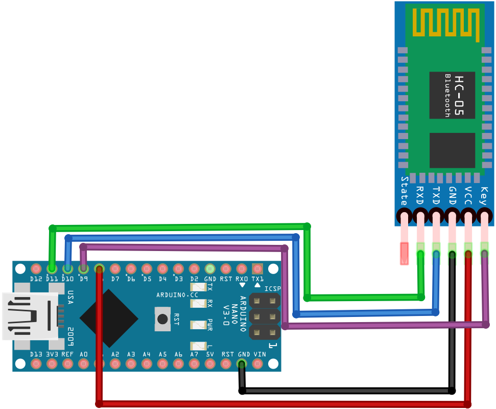

#  Comunicación entre un PC y un módulo Bluetooth 
Vamos a ver en detalle la forma mas usual y sencilla de establecer la comunicación entre un módulo Bluetooth y un ordenador a través de la conexión por puerto serie USB, es decir utilizando una placa Arduino. Tambien haremos referencia a como hacerlo a través de un conversor USB a RS232 como por ejemplo el basado en un CP2102 como el de la imagen siguiente. En este [enlace](https://naylampmechatronics.com/conversores-ttl/79-modulo-cp2102-conversor-usb-a-serial-ttl.html) a NAYLAMP tienes información mas detallada del producto.

| Conversor CP2102 |
|:|
| |

En la imagen siguiente vemos como conectar el módulo HC-05 al conversor, que a su vez va a un puerto USB del ordenador y a través del monitor serie podremos establecer la comunicación entre ambos para realizar las configuraciones oportunas mediante comandos AT, siempre que, claro está, estemos en modo AT1 o AT2 o bien en modo desconectado si estamos con un HC-06.

| Conexión PC-CP2102-HC05 con botón pulsador |
|:|
| |

#  Conexión entre Arduino Nano y HC-05 
En este caso obviamos la conexión entre la placa Arduino y el ordenador que se hace con un cable USB apropiado. En la imagen siguiente tenemos el esquema de conexionado de la placa Nano con el HC05 en el caso de que nuestro dispositivo Bluetooth disponga de botón pulsador para habilitar el modo AT. Lógicamente los pines escogidos para TX y RX los podemos cambiar sin problema por otros pines digitales de la placa.

| Conexión Arduino Nano-HC05 |
|:|
| |

Con esto ya tenemos la situación para comenzar a configurar nuestro módulo HC-05

Si nuestro módulo no dispone de botón para habilitar el comando AT el esquema de conexionado que debemos seguir será similar al de la imagen siguiente:

| Conexión Arduino Nano-HC05 sin botón pulsador|
|:|
| |

Podemos observar como la alimentación se lleva a un pin digital y además se ha conectado la patilla Enable/Key. 

Recordemos que para que el HC-05 entre en modo AT, es necesario que cuando se alimente el modulo, el pin KEY este HIGH. Esto lo conseguimos por programación conectando la tensión Vcc del módulo BlueTooth al pin 8 de nuestro Arduino. Lo que debemos hacer es poner el pin 9 en alto y tras un breve retardo hacemos lo mismo con el pin 8, lo que equivale a pulsar el botón mientras se enciende pero en este caso realizado por software.

En el apartado comandos AT veremos el programa completo trabajando con módulos sin pulsador.

#  Conexión entre Arduino Nano y HC-06 
En la imagen siguiente tenemos el esquema de conexionado de la placa Nano con el HC06.

| Conexión Arduino Nano-HC06|
|:|
| |

En todos los casos en posible utilizar una placa Arduino diferente a la Nano, he escogido esta simplemente porque es la que tenía a mano. También es posible trabajar con módulos ESP, aunque esto no lo vamos a tratar aquí para no alargar estas notas resumen sobre configuración de módulos Bluetooth HC-05 y HC-06.
