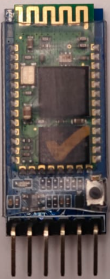
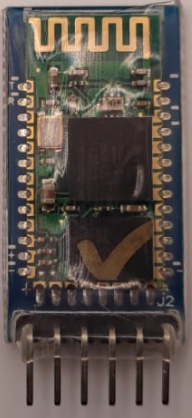
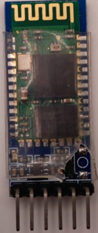
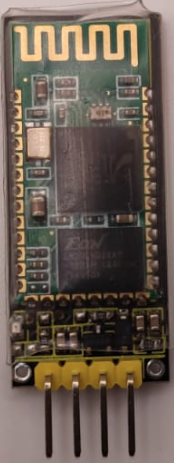
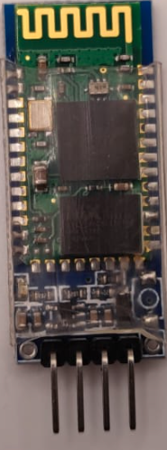
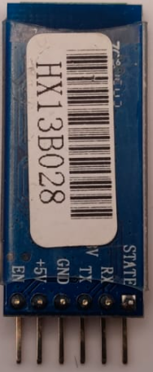
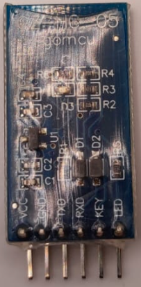
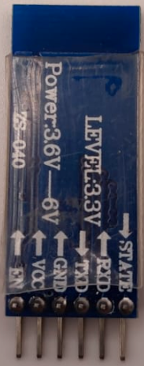
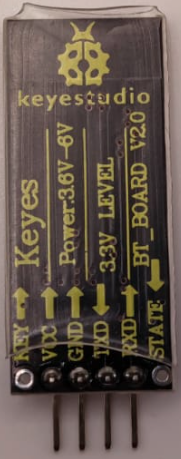
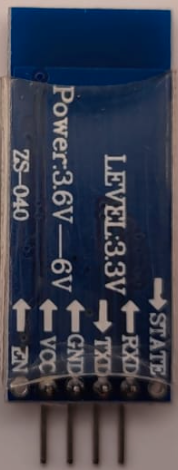

#  Generalidades 
Bluetooth es una especificación industrial para redes inalámbricas de área personal (WPAN) que permite la transmisión de voz y datos entre diferentes dispositivos emparejados mediante un enlace por radiofrecuencia en la banda ISM de 2.4 GHz. Su logotipo lo vemos en la imagen siguiente:

| Logotipo Bluetooth con texto | Logotipo Bluetooth |
|:|:|
|||

El canal de comunicación que define la especificación de Bluetooth establece máximo 720 kbit/s con rango óptimo de 10 metros. Transmitir a 10 metros de distancia requiere una potencia de salida de 1 mW (0 dBm). Los principales objetivos que se pueden conseguir con esta norma son:

- Facilitar las comunicaciones entre equipos móviles.
- Eliminar los cables y conectores entre equipos.
- Facilitar la sincronización de datos entre equipos personales.

Estamos ya muy acostumbrados a disponer de estos dispositivos en los sectores de las telecomunicaciones y la informática personal, en aparatos como PDAs, teléfonos móviles, ordenadores portátiles y personales, impresoras, cámaras digitales, etc.

#  Tipos de módulos 
Empezaremos diciendo que existen multitud de módulos Bluetooth comerciales y muchos de ellos los podemos utilizar en nuestras placas tipo Arduino, ESP32, etc. Los dispositivos dotados de un módulo Bluetooth JY-MCU van montados sobre una placa con un regulador de tensión que nos permite conectarlo a una tensión de entrada entre 3,6v a 6v. De esta forma nos despreocupamos de la tensión a los 3,3v en los que trabaja el dispositivo.

Los dos módulos que vamos a ver son los denominados HC-05 y HC-06 de los que podemos ver diferentes tipos como los mostrados en las imágenes siguiente:

| HC-05 | HC-05 | HC-05 | HC-06 | HC-06 |
|:|:|:|:|:|
| | | | | |
| | | | | |

Estos módulos son pequeños, compactos, de bajo consumo, muy económicos y por fáciles de encontrar en el mercado. El HC-05 puede trabajar como maestro/esclavo  y el HC-06 solo puede actuar como esclavo.  La diferencia entre maestro y esclavo es que en modo esclavo es nuestro dispositivo el que se conecta al módulo HC-05, mientras que en modo maestro es el módulo HC-06 el que se conecta con nuestro dispositivo, o con otros módulos.

En las imágenes anteriores vemos que ambos son muy parecidos aunque fáciles de diferenciar dado que el HC-05 dispone de 6 pines y el HC-06 solamente de 4 pines. En la tabla siguiente se relacionan la funciçon de cada pin y a que tipo de pin de Arduino debemos conectarlo.

| Nombre y función | Pin Arduino | HC-05 | HC-06 |
|---|:|:|:|
| VCC - Alimentación de 3,6 a 6V | Pin digital | VCC | VCC |
| GND - Masa | GND | GND | GND |
| TX - Transmisión datos serie | Pin digital | TX | TX |
| RX - Recepción de datos serie | Pin digital | RX | RX |
| Enable/Key - Habilitación configuración | Pin digital | EN/KEY | -- |
| STATE/LED - Estado de salida (*Nota) | No conectado | STATE/LED | -- |

(*Nota): Se puede conectar un LED al pin y visualizar cuando se comunica el módulo

En los enlaces siguientes tenemos disponibles los datasheet de ambos módulos, donde podemos consultar todas sus características.

* Modulo Bluetooth [HC-05](/datasheet/hc05.pdf)
* Modulo Bluetooth [HC-06](/datasheet/hc06.pdf)

Además de la diferencia en el número de pines también hay una diferencia fundamental en el firmware, o lo que es lo mismo, la programación interna del módulo. Ambos módulos se pueden programar mediante comandos AT (los vemos en el apartado correspondiente). El módulo HC-06 entra en modo programación siempre que lo encendemos y que no esté conectado al mismo ningún dispositivo. En cambio el módulo HC-05 requiere un modo de arranque determinado para entrar en modo programación.
