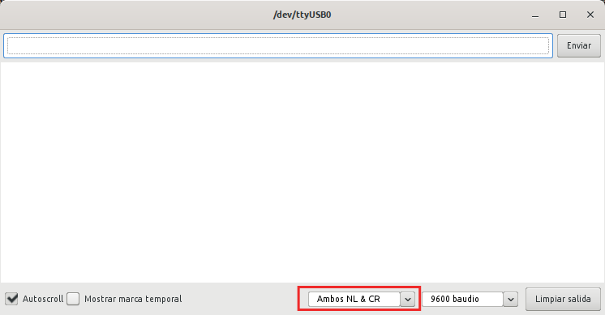
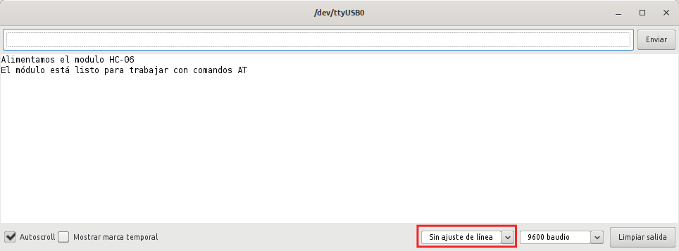

#  Comandos AT 
La compañia Hayes Communications desarrolló un conjunto de comandos para configurar y conectar sus módems, que rapidamente se convirtió en un estándar. Hayes es un lenguaje abierto de comandos. Los caracteres "AT", que preceden a todos los comandos, son acrónimo de ATtention y significa "Atención", lo que hizo que a este conjunto de comandos se le conociera como **AT commands** o **comandos AT**.

Nosotros no vamos a profundizar en exceso en estos comando y simplemente vamos a ver los que habitualmente se utilizan con los módulos Bluetooth HC-05 y HC-06.

Cuando carguemos el programa en nuestra placa Nano, abriremos el monitor serie y debemos configurar, para el caso del HC-05 como vemos en la imagen siguiente:

| Configuración del monitor serie para HC05 |
|:|
| |

Si estamos trabajando con un HC-06 la configuración en el monitor serie debe ser la que vemos en la imagen siguiente:

| Configuración del monitor serie para HC06 |
|:|
| |

