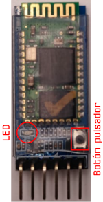
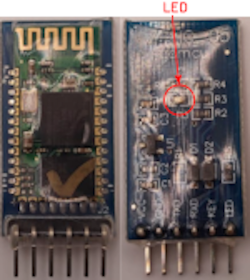
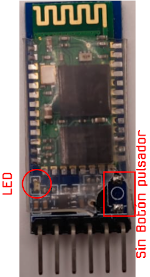

#  Módulos Bluetooth HC-05 y HC-06 
Los módulos Bluetooth HC-05 y HC-06 admiten cambios en sus configuraciones como el nombre, velocidad, código de vinculación, etc.

El HC-05 viene configurado por defecto de la siguiente forma:

* Modo o Role: Esclavo
* Nombre: HC-05
* Código de emparejamiento: 1234
* Velocidad: 9600 baudios

El HC-06 viene configurado por defecto de la siguiente forma:

* Modo o Role: Esclavo y no se puede cambiar a Maestro
* Nombre: linvor o HC-06
* Código de emparejamiento: 1234
* Velocidad: 9600 baudios

Antes de entrar en los modos de trabajo de cada uno de los módulos vamos a dar las definiciones de Maestro y Esclavo para el módulo HC-05.

* **Maestro**: Es el módulo HC-05 el que inicia la comunicación. Como dispositivo Maestro solamente puede conectarse con un dispositivo Esclavo que debemos especificar.
* **Esclavo**: En esta forma está a la espera de que un dispositivo Maestro se conecte con él. Es el modo mas usual cuando queremos conectarnos con un PC o telefóno móvil.

#  Modos de trabajo 
Aunque son bastante similares los modos de trabajo o estados de uno y otro son diferentes.

## **Modos de trabajo del HC-05**
El HC-05 dispone de cuatro modos, que son:

* **Desconectado**. El módulo entra en este estado cuando se alimenta o cuando NO se ha establecido una conexión Bluetooh con ningún dispositivo. El LED que incorpora el módulo parpadea rápidamente.
* **Conectado**. Entra en este estado cuando se establece una conexión o comunicación con otro dispositivo. El LED realiza un par de parpadeos. En este modo se establece una comunicación conocida como transparente, debido a que todos los datos que reciba el módulo HC-05 por RX son transmitidos via Bluetooth al dispositivo conectado a través de TX.
* **Modo AT1**. Se entra en este estado cuando pulsamos el botón del HC-05 tras conectarlo y alimentarlo. En este estado se pueden enviar comandos AT a la misma velocidad que tenga configurada el módulo. El LED parpadea rápidamente. Veremos en su momento que ocurre con los módulos que no disponen de este botón.
* **Modo AT2**. Para entrar en este modo debemos mantener presionado el botón mientra se alimenta el módulo, y tras encender permanece en este estado aunque soltemos el botón. En este estado se deben enviar comandos AT a una velocidad de 38400 baudios, lo cual resulta bastante útil cuando olvidamos la velocidad a la que está configurado el módulo. El LED del módulo parpadea lentamente.

En la imagen siguiente podemos observar la posición del LED al que nos referimos y la situación del pulsador o botón del que hemos hablado. También observamos que dos de los módulos no llevan implementado el citado pulsador.

| HC-05: Modelo 1 | HC-05: Modelo 2 | HC-05:Modelo 3 |
|:|:|:|
| | | |
| Con pulsador y LED |  Sin pulsador y LED en cara posterior | Con LED y pad para pulsador pero si este |

## **Modos de trabajo del HC-06**
El HC-06 dispone de dos modos o estados de funcionamiento, que son:

* **Desconectado**. El módulo entra en este estado cuando lo alimentamos o cuando no se ha establecido ninguna conexión Bluetooth con otro dispositivo. El LED del módulo parpadea con un periodo de 102 ms. En este modo se pueden enviar comandos AT al módulo.
* **Conectado**. El módulo entra en este modo cuando se establece una conexión con otro dispositivo Bluetooth. El LED permanece siempre encendido. En este modo se establece una comunicación conocida como transparente, debido a que todos los datos que reciba el módulo HC-05 por RX son transmitidos via Bluetooth al dispositivo conectado a través de TX. En este modo el HC-06 no puede interpretar comandos AT.
